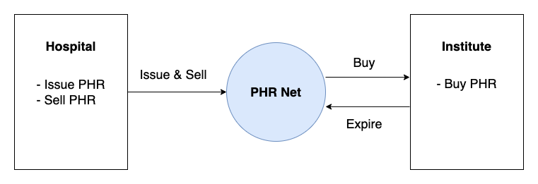

# Personal Health Record Trading System

Personal Health Record(PHR) Trading System stores the PHR in Hyperledger Fabric blockchain and allows for the PHR trading on the blockchain network.  
<br/>

## :clipboard: Contents
1. [About PHR Trading System](#🔎-about-phr-trading-system)
2. [Background](#🌱-background)
3. [Tech Stack](#📚-tech-stack)
4. [My Roles](#📝-my-roles)
5. [System Structure](#🏭-system-structure)  
<br/>

## :mag_right: About PHR Trading System
Personal Health Record(PHR) Trading System stores the PHR in [Hyperledger Fabric](https://www.hyperledger.org/use/fabric) blockchain and allows for the PHR trading on the blockchain network.  

The goal of PHR Trading System is to give priority to medical data to individuals and mitigate the inconvenience of sharing medical data.  

PHR is a service and technology that gives patients ownership of their health data. It enables patients to manage and provide their own health data.  
Blockchain technology can be used to avoid data falsification and simplify data sharing processes.  
<br/>

## :seedling: Background
I was at Electronics and Telecommunications Research Institute (ETRI), Dea-gu as a trainee from April 2020 to July 2020. At that time, I learned about private blockchain, Hyperledger Fabric, and the personal health record by taking lectures and following prepared tutorials.  
<br/>

## :books: Tech Stack
<br/>
<p align = "center">
    
    <br/>    
</p>
<br/>

## :memo: My roles 
* Network
    - Studying the Hyperledger fabric network configuration
    - Installing the Hyperledger fabric binary and, Docker image 
    - Setting up network
* Chaincode
    - Studying a commercial paper tutorial chaincode
    - Making little modification on Go chaincode   
<br/>

## :factory: System Structure
PHR trading system consists of the Hyperledger fabric network and chaincode.

### Hyperledger Fabric Network
Setting up the Hyperledger Fabric network from scratch is quite complex. Thus I used [papernet test network](https://hyperledger-fabric.readthedocs.io/en/release-2.2/tutorial/commercial_paper.html#create-the-network) to bring up Hyperledger Fabric network. Fabric network version is 2.2.9. I referred to [commercial-paper tutorial](https://hyperledger-fabric.readthedocs.io/en/release-2.2/tutorial/commercial_paper.html).  

PHRNet is a personal health record network. The network's participants can issue, trade, and expire personal health record.
The network includes two peer organizations, and a single orderer organization.  
> Peers store the blockchain ledger and validate transactions before they are committed to the ledger. Peers run the smart contracts that contain the business logic that is used to manage the assets on the blockchain ledger.  
The orderer organization decide on the order of transactions or include them into new blocks.
>
> -- <cite>[Using the Fabric test network](https://hyperledger-fabric.readthedocs.io/en/release-2.2/test_network.html)</cite>  

<br/>

#### Organizations
Two organizations, Hospital and Institute, trade the phr with each other using PHRNet, a Hyperledger Fabric blockchain network.  

<p align = "center">
    
</p>

Org1(Institute) can be research institutes, corporations, or other hospitals that need health records. Org1 buys the PHR.  
Org2(Hospital) can be a doctor's office or hospital. From a medical chart, individuals issue and sell the phr.  

The images below show the results of running PHRNet.  

<p align = "center">
    
</p>     

<p align = "center">
    
</p>
<br/>

### Chaincode    
Chaincode is smart contract on Hyperledger Fabric blockchain. Chaincode can be written in Go, JavaScript, and Java. I wanted to learn Go and try it out. So, in this project, chaincodes are written in Go. I referred to [commercial-paper chaincode in fabric sample repository](https://github.com/hyperledger/fabric-samples/tree/release-2.2/commercial-paper).

#### phr.go  
This contract defines state and structure of the phr. All ledger state share this form. A Fabric state is implemented as a key/value pair. A state key allows us to uniquely identify a paper.

I replaced REDEEMED state with EXPIRED. EXPIRED is a state that MaturityDateTime or authority are over.

```go
// State
const (
	// ISSUED state for when a phr has been issued
	ISSUED State = iota + 1
	// TRADING state for when a phr is trading
	TRADING
	// EXPIRED state for when a phr has been expired
	EXPIRED
)
```

```go
// Structure of phr
// PHR defines a phr
type PHR struct {
	PHRNumber      string `json:"phrNumber"`
	Issuer           string `json:"issuer"`
	IssueDateTime    string `json:"issueDateTime"`
	FaceValue        int    `json:"faceValue"`
	MaturityDateTime string `json:"maturityDateTime"`
	Owner            string `json:"owner"`
	state            State  `metadata:"currentState"`
	class            string `metadata:"class"`
	key              string `metadata:"key"`
}
```

#### phrcontract.go 
This contract contains the transaction definitions for phr – issue, buy and expire on the ledger.   

* Issue
    - Create the new phr.
    - Add the new phr to the list of all phrs. 
    - Return the new phr (serialized as a buffer) as the transaction response.
    - Require a sign of the hospital.

* Buy
    - Change the ownership to the new owner.
    - Update the phr on the ledger.
    - Return the updated phr (serialized as a buffer) as the transaction response.
    - Require signs of two organizations. 

* Expire
    - Change the ownership back to a issuer.
    - Update the phr on the ledger.
    - Return the updated phr (serialized as a buffer) as the transaction response.
    - Require signs of two organizations.   

#### phrlist.go
This contract is used to help store and retrieve all PHRNet phrs in Hyperledger Fabric state database.  

#### phrcontext.go    
This contract includes the minimum required functions for a transaction context in the phr.

> Transaction context, By default, it maintains both per-contract and per-transaction information relevant to transaction logic. For example, it would contain Hospital’s specified transaction identifier, a Hospital issuing user’s digital certificate, as well as access to the ledger API.
>
> -- <cite>[Smart contract process](https://hyperledger-fabric.readthedocs.io/en/release-2.2/developapps/smartcontract.html)</cite>

<br/>

The image below shows the test results.  
<p align = "center">
    
</p>


